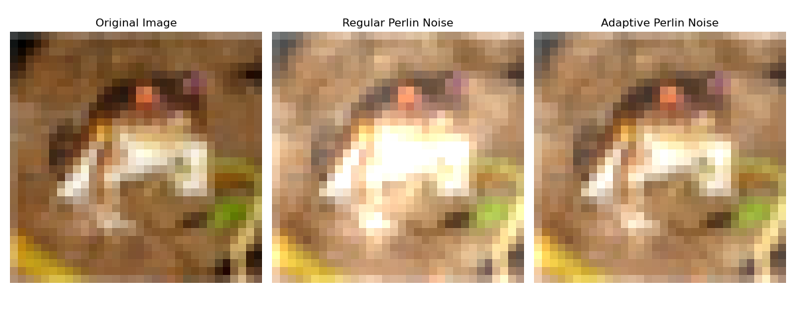

# Adversarial Defense with Perlin Noise

This repository contains the implementation of an adversarial defense mechanism for Purdue's CS587 final project. The approach uses region-adaptive Perlin noise to enhance the robustness of a ResNet-18 model against adversarial attacks on the CIFAR-10 dataset. 

The core idea is to apply noise adaptively. Uniform noise can obscure important features, while the adaptive approach preserves them, as shown below:



--- 

**Key features**:

* **Region-Adaptive Noise:** Applies Perlin noise with varying intensity based on image region importance, identified using Grad-CAM heatmaps.
* **Adversarial Training:** Fine-tunes a pre-trained ResNet-18 model on a mixed dataset of clean and noise-augmented images to improve robustness.
* **Attack Evaluation:** Includes scripts to test the model's performance against both procedural noise and gradient-based attacks like the Fast Gradient Sign Method (FGSM).
* **Visual Analysis:** Generates visualizations of Perlin noise patterns and Grad-CAM heatmaps to provide insight into the defense mechanism.
  
---

## Setup & Prerequisites

[](https://doi.org/10.5281/zenodo.4431043)

1.  **Dependencies:** Ensure you have Python 3 installed, along with libraries like PyTorch, TorchVision, NumPy, and Matplotlib. You can typically install these using pip:
    ```bash
    pip install torch torchvision numpy matplotlib noise tqdm
    ```

2.  **Pre-trained Model:** This project requires a pre-trained ResNet-18 model for CIFAR-10. The model weights are provided in the repository cited above. You must download the `resnet18.pt` file and place it in the root directory of this project.
    * **Download Link:** You can acquire the model file from the original [PyTorch_CIFAR10 repository's cifar10_models folder](https://github.com/huyvnphan/PyTorch_CIFAR10).

---

## Scripts Included:

**Data Generation & Training**

* `compute_gradcam.py`: Generates and saves Grad-CAM importance maps for the training images. **(Required for training)**

* `augmented_data.py`: Creates an augmented dataset and trains the new, defended models.

* `fgsm.py`: Implements the Fast Gradient Sign Method (FGSM) to generate an adversarial test set. **(Required for FGSM evaluation)**

**Evaluation**

* `baseline.py`: Evaluates the original ResNet-18 model against the FGSM attack.

* `baseline_test_perlin.py`: Tests the original model against randomized Perlin noise attacks.

* `test.py`: Evaluates the fine-tuned (defended) models against randomized Perlin noise attacks.

* `test_fgsm.py`: Evaluates the fine-tuned (defended) models against the pre-generated FGSM attack dataset.

**Utilities**

* `perlin_examples.py`: Generates and visualizes different Perlin noise configurations. **(Optional)**

---

## Usage Example:

To train the defended model and evaluate its performance, you can follow these general steps:

```bash
# 1. Compute and save Grad-CAM maps for the training data
python compute_gradcam.py

# 2. Generate the augmented dataset with region-adaptive Perlin noise, saving the new defended model weights in the fine_tuned_models/ directory.

python augmented_data.py

# 3. Train the model on the augmented dataset (training is initiated within augmented_data.py)

# 4. Generate adversarial examples using FGSM. This creates the cifar10_fgsm.pt file needed to evaluate robustness against FGSM attacks.
python fgsm.py

# 5. Evaluate the original, undefended model
python baseline.py
python baseline_test_perlin.py

# 6. Evaluate the new, defended model(s)
python baseline.py
python baseline_test_perlin.py

# 7. Visualize Noise Patterns (Optional)
python perlin_examples.py
